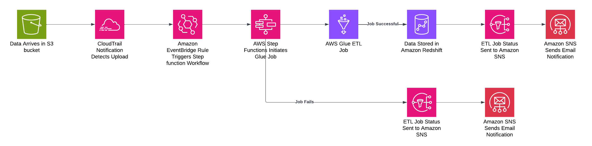
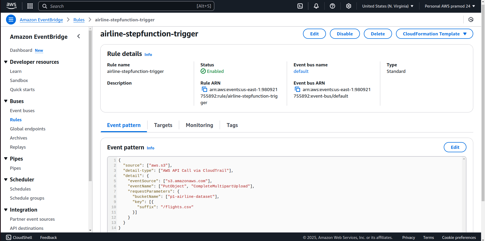
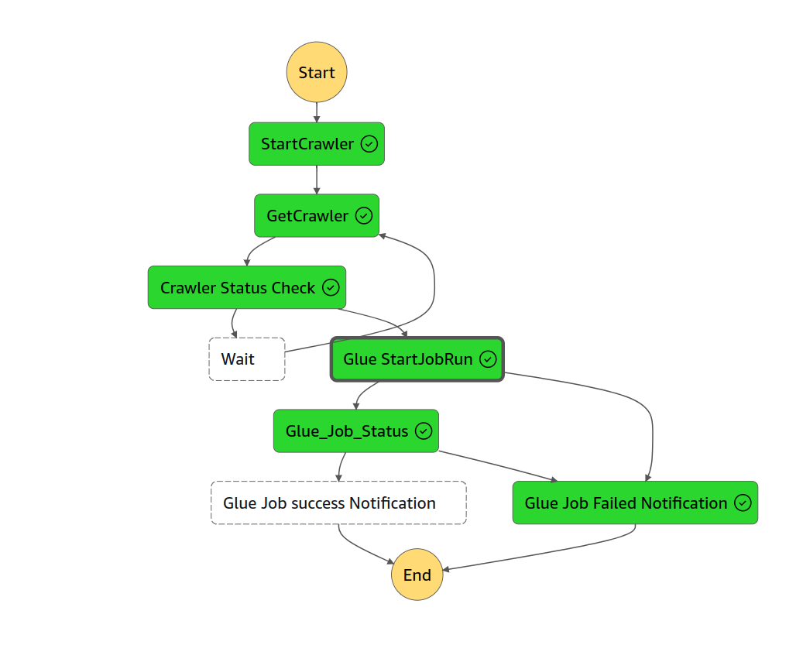
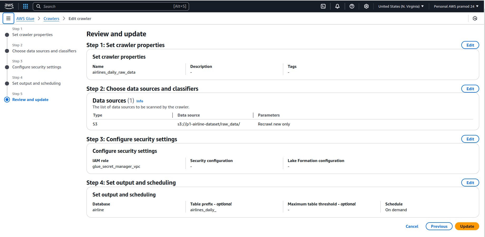
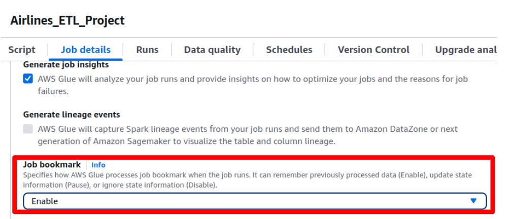

# Airline Data Ingestion Project | AWS 
## Introduction 
Airline-Data-Ingestion-Project is a data pipeline that collects, processes, and stores airline data in a central data warehouse. Data uploaded in S3 buckets is read, and an ETL job is performed before finally being stored into a Redshift table. It uses AWS cloud services to automate tasks, such as detecting new files, running data transformations, and storing the results. 

This project ensures that data is handled efficiently and is ready for analysis, making it easy to generate insights and reports. It’s designed to be reliable, scalable, and simple to use. 


## Architecture 


## Tech Stack 
- AWS S3
- Cloudtrail Notification 
- Event Bridge Pattern Rule 
- Glue Crawler 
- Glue Visual ETL 
- AWS SNS 
- AWS Redshift 
- AWS Step Function

## Dataset Description

The dataset contains daily flight information for airlines in the United States. It tracks details such as delays, departure and arrival locations, and carrier information. The data is sourced from daily CSV uploads to an Amazon S3 bucket and ingested into Redshift through an ETL pipeline.

Business Problems Addressed by the ETL Job
- Delay Analysis: Enables identifying problematic routes and airports by analyzing flight delays across locations, helping airlines improve efficiency.
- Carrier Performance: Provides insights into carrier delays on specific routes, aiding decisions on resource allocation and policy adjustments.

### Table Details

1. #### Fact Table: `daily_flights_fact`
- Purpose:
  Stores enriched flight data, combining flight metrics with details from the dimension tables for analysis.

- Schema:

| Column Name    | Data Type      | Description                                         |
|----------------|----------------|-----------------------------------------------------|
| `carrier`      | VARCHAR(10)    | Airline identifier . |
| `dep_airport`  | VARCHAR(200)   | Departure airport name.                            |
| `arr_airport`  | VARCHAR(200)   | Arrival airport name.                              |
| `dep_city`     | VARCHAR(100)   | City of the departure airport.                     |
| `arr_city`     | VARCHAR(100)   | City of the arrival airport.                       |
| `dep_state`    | VARCHAR(100)   | State of the departure airport.                    |
| `arr_state`    | VARCHAR(100)   | State of the arrival airport.                      |
| `dep_delay`    | BIGINT         | Departure delay in minutes.                        |
| `arr_delay`    | BIGINT         | Arrival delay in minutes.                          |

---

2. #### Dimension Table: `airports_dim`
- Purpose: Provides descriptive details about airports for enrichment.

- Schema: 

| Column Name    | Data Type      | Description                                         |
|----------------|----------------|-----------------------------------------------------|
| `airport_id`   | VARCHAR(50)    | Unique identifier for the airport.                 |
| `city`         | VARCHAR(100)   | City where the airport is located.                 |
| `state`        | VARCHAR(100)   | State where the airport is located.                |
| `name`         | VARCHAR(200)   | Full name of the airport.                          |

---

3. #### Sample CSV Data (`flights.csv`)
   - CSV data uploaded daily in the S3 bucket.

| Carrier | Origin Airport ID | Dest Airport ID | Dep Delay (mins) | Arr Delay (mins) |
|---------|--------------------|------------------|------------------|------------------|
| AA      | ORD                | LAX              | 15               | 10               |
| DL      | JFK                | ATL              | -5               | -3               |
| UA      | DEN                | SFO              | 20               | 25               |

---

## ETL Pipeline 
### 1.EventBridge Trigger
- Daily flight data is uploaded to an S3 bucket in a partitioned manner, where the folder name corresponds to the date. The data is stored in a flights.csv file. An EventBridge rule detects file uploads with the suffix /flights.csv in the S3 bucket and triggers a Step Function State Machine.
   
### 2.Stepfunctions StateMachine
   - The Step Function State Machine orchestrates the workflow of ETL pipeline,ensuring each step in the pipeline is executed in the correct order with error handling and notifications.

  
     
### 3.Glue ETL job 

#### 3.1 Running Glue Crawler to Detect Data
- *Glue crawler to detect new partitions in S3 bucket*
  
  

- _Code to read S3 data from Glue catalog_

 ```python
  Daily_raw_data_read_S3_node1733823614922 = glueContext.create_dynamic_frame.from_catalog(database="airline", table_name="airlines_daily_raw_data", transformation_ctx="Daily_raw_data_read_S3_node1733823614922")

  ```
#### 3.2 Reading data from Redshift
- _Code to read dimension table data from Redshift_

 ```python
  Dimension_table_read_node1733824945709 = glueContext.create_dynamic_frame.from_options(
    connection_type="redshift",
    connection_options={
        "url": "jdbc:redshift://redshift-cluster--------.us-east-1.redshift.amazonaws.com:5439/dev",
        "user": "awsuser",
        "password": "********",
        "dbtable": "airlines.airports_dim",
        "redshiftTmpDir": "s3://redshift-jobs-staging-directory/"
    },
    transformation_ctx="Dimension_table_read_node1733824945709"
)

  ```

#### 3.3 Joining and Transforming the daily flight data read from S3
- _Code for joining data from S3, redshift and schema change_
``` python

Join_node1733825055250 = Join.apply(frame1=Daily_raw_data_read_S3_node1733823614922, frame2=Dimension_table_read_node1733824945709, keys1=["originairportid"], keys2=["airport_id"], transformation_ctx="Join_node1733825055250")

ChangeSchema_node1733825211532 = ApplyMapping.apply(frame=Join_node1733825055250, mappings=[("carrier", "string", "carrier", "string"), ("destairportid", "long", "destairportid", "long"), ("depdelay", "long", "depdelay", "bigint"), ("arrdelay", "long", "arrdelay", "bigint"), ("city", "string", "city", "string"), ("name", "string", "name", "string"), ("state", "string", "state", "string")], transformation_ctx="ChangeSchema_node1733825211532")

Join_node1733825341140 = Join.apply(frame1=ChangeSchema_node1733825211532, frame2=Dimension_table_read_node1733824945709, keys1=["destairportid"], keys2=["airport_id"], transformation_ctx="Join_node1733825341140")

ChangeSchema_node1733825415703 = ApplyMapping.apply(frame=Join_node1733825341140, mappings=[("carrier", "string", "carrier", "string"), ("state", "string", "dep_state", "string"), ("`.state`", "string", "arr_state", "string"), ("`.city`", "string", "arr_city", "string"), ("city", "string", "dep_city", "string")], transformation_ctx="ChangeSchema_node1733825415703")
```
#### 3.3 Storing Data in Redshift
- Storing the output data in the `daily_flights_fact` table in Redshift.
``` python Redshift_Fact_table_updation_node1733825570739 = glueContext.write_dynamic_frame.from_options(
    frame=ChangeSchema_node1733825415703, 
    connection_type="redshift",
    connection_options={
      "url": "jdbc:redshift://redshift-cluster--------.us-east-1.redshift.amazonaws.com:5439/dev",
        "user": "awsuser",
        "password": "********",
        "dbtable": "airlines.daily_flights_fact", 
        "redshiftTmpDir": "s3://redshift-jobs-staging-directory"
    },
    transformation_ctx="Redshift_Fact_table_updation_node1733825570739"
)


job.commit() 
```
- Glue Job bookmark is enabled to perform ETL only for the incremental data arriving in S3 bucket. 
  
  
